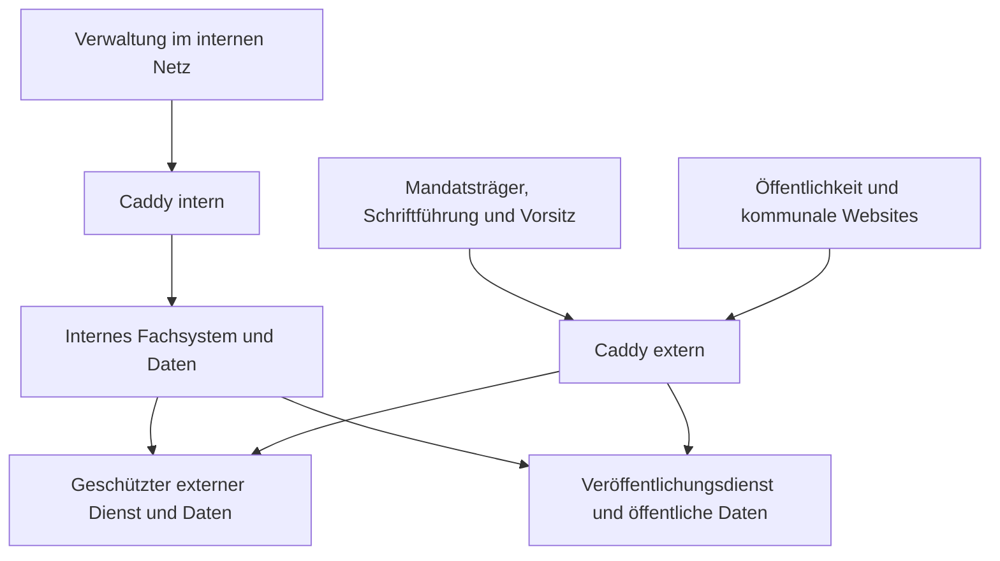

# Architektur und Sicherheit

## Verbindliche Grenzen

Zwei Server: internes Verwaltungsfachsystem und externer Server. Verwaltung arbeitet ausschließlich intern beziehungsweise über außerhalb der Anwendung betriebenes VPN. Mandatsträger und Schriftführung/Vorsitz greifen auch von außen auf geschützte Dienste zu. Nichtöffentliche Inhalte dürfen außen gespeichert werden. Der interne Server initiiert Datenübertragung und Abholung; vom externen Server initiierte Verbindungen nach innen sind standardmäßig verboten und nur nach ausdrücklicher Genehmigung möglich.

Bürgerportal und geschützter Außendienst sind unterschiedliche Vertrauensbereiche. Auch auf demselben externen Host benötigen sie getrennte Datenbanken/Dateibereiche, Netzwerke, Dienstidentitäten und Cookies. Ein kompromittierter Host bleibt allerdings eine gemeinsame Ausfall-/Angriffsgrenze; Container allein garantieren keine Isolation gegen Hostadministration oder Kernelkompromittierung.

## Zieltopologie

Die Pfeile vom internen Fachsystem bezeichnen vom internen Server initiierte Verbindungen. Eine Antwort auf eine interne Abholanfrage darf Ereignisse enthalten; sie ist keine außen initiierte Verbindung. Öffentliche Dienste erhalten keinen allgemeinen Datenbankzugriff und keine Leserechte am geschützten Dateibestand.

## Technische Komponenten: Vorschlag

| Bestandteil | Vorschlag und Zweck |
|---|---|
| Backend | Python/Django als modularer Monolith; definierte Fachmodule statt Service pro Funktion |
| API | Django REST framework, versionsgebundene Verträge; sitzungsbezogene Aktualisierung über SSE/WebSocket oder Polling nach gesonderter Entscheidung |
| Frontend | React/TypeScript, gemeinsame Komponenten; getrennte Builds/Zugangsflächen für intern, geschützt und öffentlich |
| Daten | PostgreSQL je Vertrauensbereich; lokale persistente Dateibereiche getrennt |
| Suche | PostgreSQL-Volltext zunächst; PDFs in isolierten Jobs extrahieren, Rechte auch für Suchindex und Vorschautext |
| Hintergrundarbeit | Getrennte Prozesse für Export, Mail, Sync und Dateiverarbeitung; dauerhafte Aufträge/Wiederholungen, Queue-Technik noch festzulegen |
| TLS/Zugang | Caddy je Server; öffentlich nur ausdrücklich freigegebene Domains/Dienste |
| Dokumente | Gemeinsames eingeschränktes Markdown-Modell, serverseitige Renderer für PDF/DOCX; konkrete Bibliotheken nach Layoutprototyp auswählen |
| Erweiterungen | Speicher-, DMS-, OParl-, KI- und Abrechnungsadapter mit dokumentierten Grenzen |

Konkrete Versionen, Skalierung und Hardware sind vor Umsetzung gegen unterstützte Laufzeiten und Projekterfordernisse festzulegen. Serverrollen können dasselbe gepflegte Backendpaket verwenden, aber nur ihre erlaubten Module/API-Flächen aktivieren. Ein nur im Frontend ausgeblendeter Verwaltungsendpunkt ist keine ausreichende Trennung.

## Fachliche Zuständigkeit der Daten: Vorschlag

| Bereich | Führender Stand |
|---|---|
| Organisation, Rechte, Vorlagen, Freigaben, Sitzungsvorbereitung | Internes System |
| Öffentliche Inhalte | Intern freigegebener Veröffentlichungsstand, extern nur Projektion |
| Laufende externe Sitzung | Für diese Sitzung ausdrücklich aktivierter geschützter Außendienst |
| Fraktionsarbeit/persönliche externe Notizen | Geschützter Dienst als Ursprung; berechtigt intern abholen, keine öffentliche Kopie |
| Endgültige Niederschrift und Veröffentlichung | Intern nach übernommenem Sitzungsstand und Prüfung |

Vor Beginn wird die Sitzung samt benötigten Teilnehmern, Rechteauszug, Regelprofil und Unterlagen vollständig extern bereitgestellt. Aktivierung überträgt die Sitzungshoheit eindeutig auf den externen Sitzungsdienst. Intern sind dieselben Sitzungsereignisse dann nicht unabhängig veränderbar. Schriftführung und digitale Stimmen treffen am selben führenden Dienst ein; interne Abholverzögerung darf keine Abstimmung blockieren.

Nach Abschluss werden Ereignisse intern abgeholt und geprüft. Rückgabe der Sitzungshoheit verlangt abgeglichenen Stand und eindeutige Bestätigung. Korrekturen bei Offlinegerät, Übernahme oder unvollständigem Sync brauchen einen kontrollierten Ablauf. Dieses Zuständigkeitsmodell ist zu validierender Architekturentwurf, keine bereits implementierte Konsistenzgarantie.

## Synchronisierungsvertrag: Vorschlag

- Unterschiedliche Kanäle für öffentliche Veröffentlichungen und berechtigte geschützte Daten, getrennte Dienstschlüssel.
- Interne Outbox, externe Inbox/Ereignisablage und interne Quittierung; lokale Transaktion verbindet Fachänderung mit Übertragungsauftrag.
- Ereignisse haben eindeutige ID, Quelle, Körperschaft, Objektversion, Sequenz/Abhängigkeit und Schemafassung.
- Authentisierte, verschlüsselte Dienstverbindung; Paketintegrität, Größen-/Typgrenzen und Wiederholungsschutz.
- Wiederholbare Übertragung mit Backoff; gleiche Ereignis-ID erzeugt genau eine fachliche Wirkung. Kein Anspruch auf garantiert einmalige Netzwerkzustellung.
- Dateiübertragung mit Manifest/Prüfsumme; neuer sichtbarer Dokumentstand erst aktivieren, wenn alle nötigen Dateien vollständig vorhanden sind.
- Untrusted externe Aktionen werden intern erneut fachlich geprüft. „Vom externen Dienst geliefert“ ist kein Freibrief für Rollenvergabe oder Veröffentlichung.
- Widersprüche nach Objektverantwortung behandeln, niemals pauschal „letzte Änderung gewinnt“ für Beschlüsse, Rechte oder Abstimmungen.
- Entzug/Ablauf von Rechten priorisiert übertragen. Externe Rechtekopie mit Frischegrenze; bei zu altem Stand geschützte Aktionen sperren. Grenzwert noch zu entscheiden.
- Rücknahme/Löschung als versionierte Sperr-/Löschereignisse, abgestimmte Cache-/Dateibereinigung und Statusanzeige.
- Dienstschlüssel rotieren; unerwartete neue Kanäle und Datenfelder ablehnen. Keine automatische bidirektionale Vollreplikation.

Der Bürgerbereich bleibt bei internem Ausfall mit zuletzt freigegebenen Daten verfügbar. Eine neue Rücknahme kann ihn bei Netzunterbrechung erst nach Übertragung erreichen; das System zeigt intern die ausstehende Wirkung. Bereits extern heruntergeladene oder gedruckte Daten sind nicht zurückholbar.

## Authentisierung und Rechte

Eigenständige Anmeldungen im jeweiligen Bereich vermeiden einen von außen benötigten internen Identity-Endpunkt. Identitäten/erlaubte Zuweisungen werden kontrolliert provisioniert; ein universell akzeptiertes Token für alle Dienste ist nicht vorgesehen. Speicherort der Anmeldedaten, Faktorenregistrierung und Synchronisierung von Kontosperren sind vor Implementierung detailliert zu entscheiden. Dienstschlüssel für Synchronisierung sind nicht Benutzerpasswörter.

Passwort plus E-Mail-Code ist die vorgesehene Auslegung des bestätigten Standards „eigene Konten mit 2FA per E-Mail“, auch für Administration. Passwörter werden ausschließlich mit geeignetem Passwort-Hashverfahren gespeichert, niemals im Klartext synchronisiert oder versendet. Codeanforderungen: kurzlebig, einmalig, begrenzte Fehlversuche, Versandlimit, keine Nutzerexistenz preisgeben, Bindung an Anmeldevorgang; Code nicht in Logs. TOTP und Passkeys konfigurierbar, Wiederherstellung kontrolliert. Die genaue Ausgestaltung von Passkeys als zusätzlichem Faktor oder passwortloser Anmeldung bleibt Detailentscheidung. NIST-konforme MFA wird mit dem E-Mail-Default nicht zugesichert.

Sichere Session-Cookies, CSRF-Schutz, restriktive CORS-/Origin-Regeln, Sitzungsablauf und Logout/Entzug an allen Diensten sind Pflicht. Kontext und Objektzugehörigkeit auf jeder Anfrage prüfen; Suchtreffer, Downloadlinks und Exportjobs sind keine Ausnahmen. Kein öffentlich erreichbares Caddy-Admininterface, Datenbank-/Queue-Port oder allgemeiner Managementendpunkt.

## Dateiverarbeitung und Webschutz

Uploadgrenzen, erlaubte Typen, Prüfung von Dateiinhalten, isolierte Extraktion/Renderer und optionaler Malwareprüfadapter. Keine externen URL-Abrufe aus Markdown/Exporten ohne begrenzte Freigabe; SSRF und Zugriff auf interne Dienste verhindern. HTML/Markdown bereinigen, Scripts/Eventhandler und unzulässige URLs entfernen. Hochgeladene Assets können keine Konfiguration oder Serverprogramme ausführen.

Schutz gegen IDOR, XSS, CSRF, Injection, Credential-Angriffe, Ressourcenerschöpfung und missbräuchliche Exporte. CSP und insbesondere iframe-Freigabe getrennt je Oberfläche. Nur öffentliche Seiten dürfen von explizit genehmigten kommunalen Origins eingebettet werden; geschützte Oberflächen direkt öffnen. Geheimnisse weder im Repository noch im Browserbuild, in Fehlermails oder Logs.

## Offline und geheime Abstimmungen

Offline ist auf ausdrücklich vorbereitete Sitzungen und erlaubte Geräte begrenzt. Lokalen Bestand, Ablauf, Löschaktion und ausstehende Änderungen anzeigen. Entzogene Rechte verhindern erneute zentrale Annahme, entfernen aber nicht magisch bereits gespeicherte Daten. Keine ungesicherte lokale Schlüsselablage als angeblich vollständiger Schutz. Offline auf gemeinsam genutzten Geräten abschaltbar.

Digitale Stimmen nur online an den führenden Dienst. Geheime Verfahren müssen Teilnahme und Stimmwert trennen, auch in Logs, Exporten, Backups und Dienstabläufen. Kein selbst erfundenes Kryptoprotokoll als ungeprüfte Sicherheitsgarantie. Konkretes Verfahren und fachliche Zulässigkeit je Einsatz sind offene Pflichtentscheidungen vor Abnahme.

## Betriebsgrenzen

Einzelserverprofile erhalten dieselben fachlichen/Anwendungsgrenzen; sie besitzen keine getrennte physische Hostgrenze. Öffentlich erreichbare Administration des Betriebs gehört nicht in den gewöhnlichen Schriftführungszugang. Domain-/TLS-Änderungen werden intern administriert und über einen eng begrenzten, intern initiierten Steuerkanal extern angewendet. Eine allgemeine Shell, beliebige Caddy-Konfiguration und Docker-Socket-Zugriff aus der Webanwendung sind nicht vorgesehen.
